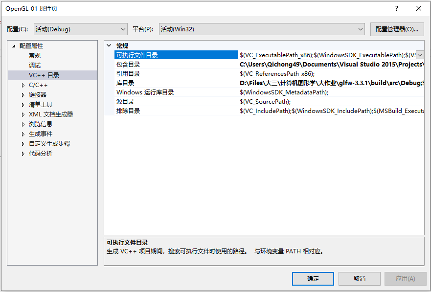
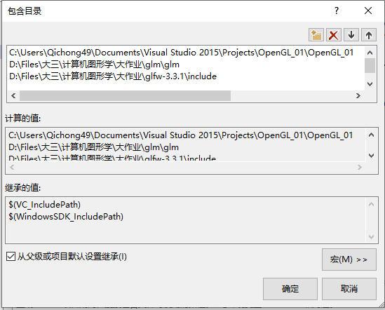
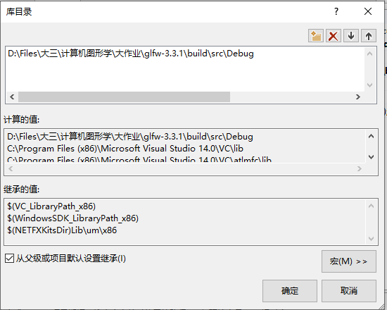

# 项目配置说明

**更新：**release的exe虽然能运行但是是一个黑色方块，而且没有镜头变换，不知道为啥...debug模式下倒是可以正常运行

由于包含了外部库，所以在此说明相关配置。

1. 项目→OpenGL_01属性→配置属性→VC++目录

   

2. 在包含目录中添加`glm\glm`与`glfw-3.3.1\include`文件夹，若项目无法找到项目内自定义头文件，则再添加`Visual Studio 2015\Projects\OpenGL_01\OpenGL_01`文件夹

   

3. 在库目录中添加`glfw-3.3.1\build\src\Debug`文件夹

   

4. 选择链接器→输入，添加`opengl32.lib`与`glfw3.lib`

   
   
5. 在项目源文件中添加现有项→`glad\src\glad.c`，此文件为在线选择OpenGL版本后自动生成。

配置完成。
